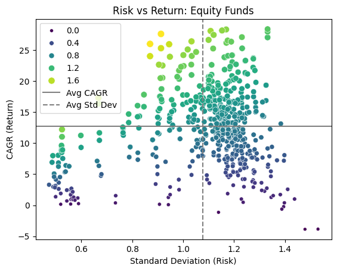
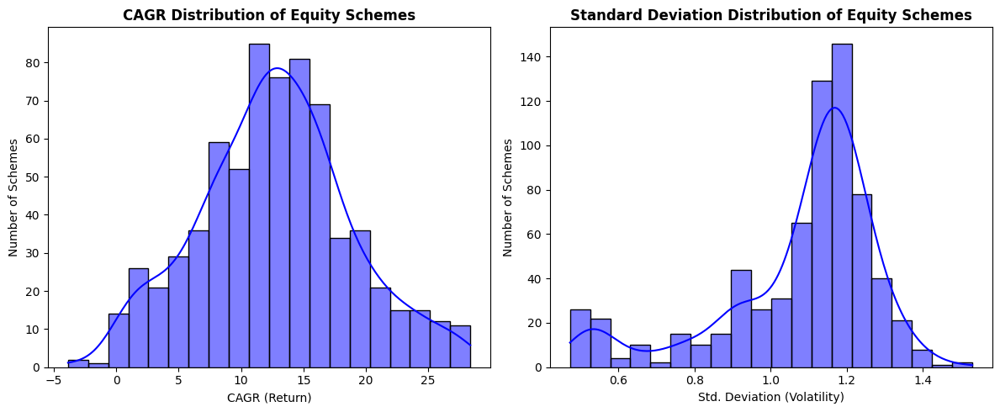
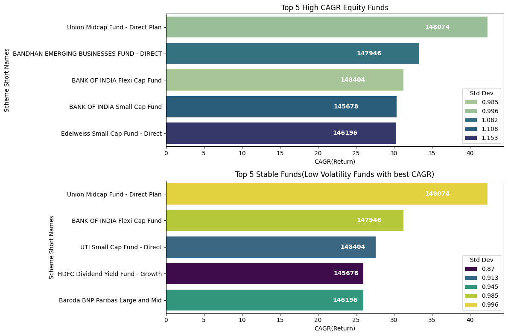
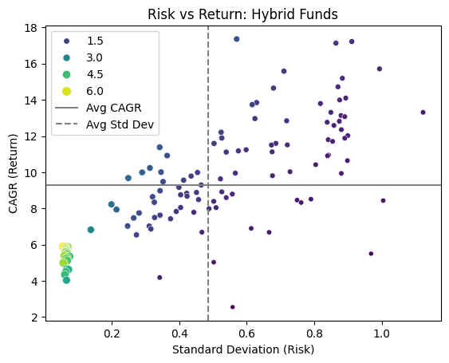
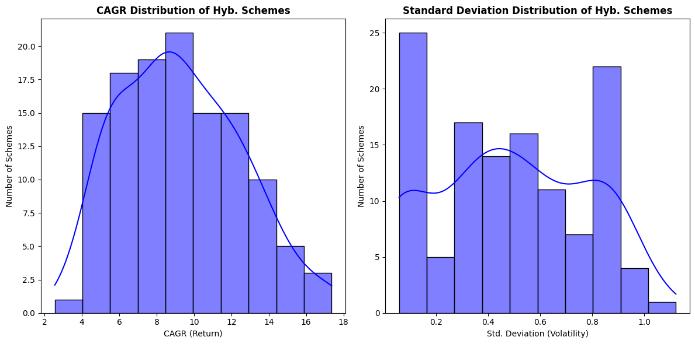
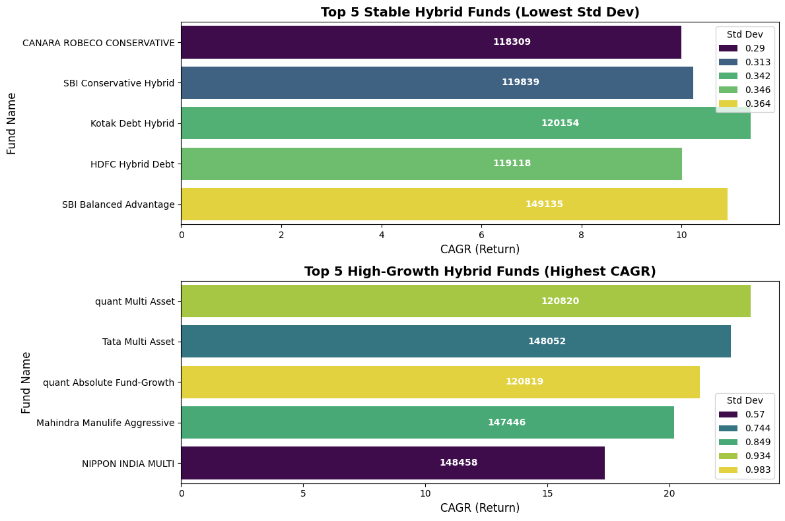
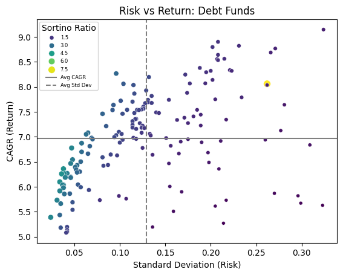
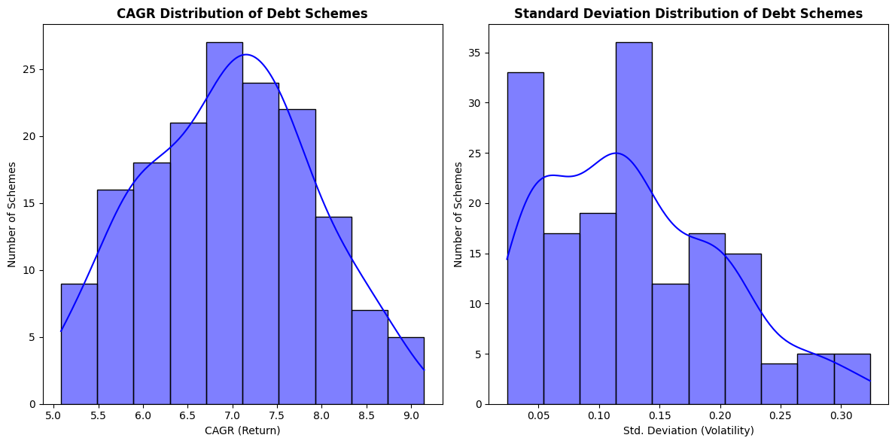
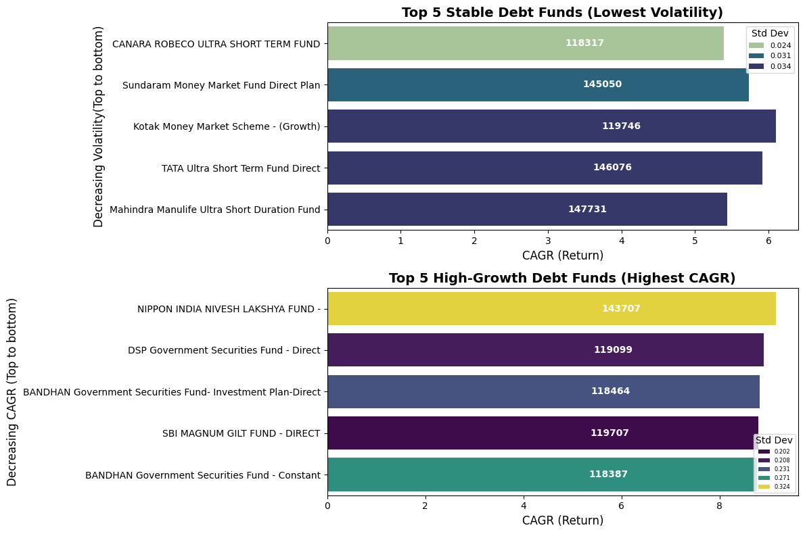

# Mutual Funds Data Analysis Project

## Overview
* This project analyzes different types of mutual fund schemes for various types of investment goals.
* It is done for different categories of mutual funds (Equity, Debt and Hybrid) using key financial metrics such as CAGR, Sharpe Ratio, Sortino Ratio, and Standard Deviation. The goal is to identify top-performing funds while filtering out poor performers and outliers.

## Key Analysis
**Performance Evaluation**:  Used CAGR to measure annualized returns.
 
**Risk Assessment**:  Analyzed standard deviation to understand volatility.

**Risk-Adjusted Returns**: Computed Sharpe & Sortino Ratios to compare returns relative to risk.

**Outlier Removal**: Used InterQuartile Range-based filtering to exclude extreme values in the dataset.

 **Data Visualization**: Created multiple Seaborn visualizations for insights.

 ## The Questions
 #### 1. What are the best mutual funds of different types (Equity, Debt and Hybrid) ?
 #### 2. How is risk and return associated with each other in different schemes?
 #### 3. What are the funds one can invest in, depending on portfolio and investment goals ?

## Tools I Used

### Python:
* The backbone of my analysis, allowing me to analyze the data and find critical insights.I also used the following Python libraries:

* Pandas Library: This was used to analyze the data.
* Matplotlib Library: I visualized the data.
* Seaborn Library: Helped me create more advanced visuals.

### Jupyter Notebooks: 
* The tool I used to run my Python scripts which let me easily include my notes and analysis.

### Visual Studio Code:
* My go-to for executing my Python scripts.
### Git & GitHub:
 Essential for version control and sharing my Python code and analysis, ensuring collaboration and project tracking.
### MS Excel
* Used to retrieve Data from the source for loading into the computer.
* Storing final processed datasets for efficient analysis
* Can be used for final reports

## Data Preparation and Cleanup
**This section outlines the steps taken to prepare the data for analysis, ensuring accuracy, efficiency and usability.**
### Import and Cleanup Data
I started by importing necessary libraries and loading the dataset, followed by initial data cleaning tasks to ensure data quality.
```python
#Import Libraries
import pandas as pd
import numpy as np

# Loading Data
df = pd.read_csv('/Users/AribM/Desktop/Mutual Funds India-Data Analysis/SourceData.csv')

# Filtering and Cleaning Data
df['Date'] = pd.to_datetime(df['Date'],dayfirst=True)
df=df[df['Date'] >= '2018-07-23'] # Analysing Data for 5 year period, i.e, 2018-07-23 to 2023-07-23
df['min_date'] = df.groupby(by='Scheme_Code')['Date'].transform('min') # Getting the earliest date of fund data
df['max_date'] = df.groupby(by='Scheme_Code')['Date'].transform('max') # Getting the latest date of fund data
df = df.sort_values(by=['Scheme_Code','Date']).reset_index(drop=True) # Sorting by Scheme_Code and Date
df=df[df['max_date'] >= '2023-01-01'] #Removing Mutual Funds whose data has not been recieved after 2022
df['no_of_days']=(df['max_date']-df['min_date']).dt.days # Calculating the number of days of data for the given fund
df=df[df['no_of_days'] >= 365] # Filtering out MFs whose data is available for less than 1 year
df = df[df['NAV'] != 0] # Removing 0 NAV values
df.dropna(subset='NAV',inplace=True) # Removing NaN NAV values for consistency and precision 
```
#### View the complete notebook in which I have done pre processing:[Pre Processing](https://github.com/Arib-Mustafa/Mutual_Funds_DA_Project/blob/main/1_Data_Pre_Processing.ipynb)
## The Analysis
### 1. What are the best Schemes according to the data available in each type?
* I ananlysed the data and created visualizations showing the best funds according to different types.
* For this, I have plotted the best funds according to best returns and according to lowest risk for every type (Equity,Hybrid and Debt)
* From these visualizations the investor can look at funds and decide what to invest in according the investment goals.
#### View my Notebook with detailed steps here: 
* [For Equity Funds](https://github.com/Arib-Mustafa/Mutual_Funds_DA_Project/blob/main/2_Equity_funds.ipynb)
* [For Hybrid Funds](https://github.com/Arib-Mustafa/Mutual_Funds_DA_Project/blob/main/3_Hybrid_funds.ipynb)
* [For Debt Funds](https://github.com/Arib-Mustafa/Mutual_Funds_DA_Project/blob/main/4_Debt_funds.ipynb)

## Visualizations and Results
### Equity Schemes
#### Risk vs Return Scatter Plot
* The outliers were removed prior to plotting to avoid skewing of data.
```python
sns.scatterplot(data=df_plot,x='std_dev',y='CAGR',size='Sharpe_annual',hue='Sharpe_annual',palette='viridis')
plt.axhline(df_plot['CAGR'].mean(), linestyle='solid', color='gray', label="Avg CAGR")
plt.axvline(df_plot['std_dev'].mean(), linestyle='dashed', color='gray', label="Avg Std Dev")
plt.xlabel("Standard Deviation (Risk)")
plt.ylabel("CAGR (Return)")
plt.title("Risk vs Return: Equity Funds")
plt.legend()
plt.show()
```
#### Results


#### Insights
1. **Higher Risk, Higher Return**: Many funds with higher standard deviation (risk) tend to have higher CAGR (return), though there are exceptions.
2. **Clusters Around Average**: A large concentration of funds is near the average standard deviation (dashed line) and average CAGR (solid line).
3. **Outliers**: Some funds with low risk still achieve high returns (top-left), while some high-risk funds perform poorly (bottom-right).
4. **Color Gradient**: The color scale indicates Sharpe Ratio, where yellow represents the highest values, suggesting the most efficient funds.
5. **Below-Average Performers**: Many funds fall below the average CAGR line, meaning they might not be delivering strong returns despite varying risk levels.
#### What is the risk and return distribution in Equity Schemes ?
**Plotting the Data**:
```python
fig,ax = plt.subplots(1,2,figsize=(12,5))
sns.histplot(data=df_plot['CAGR'],bins=20,kde=True,color='blue',ax=ax[0])
sns.histplot(data=df_plot['std_dev'],bins=20,kde=True,color='blue',ax=ax[1])
# Formatting SubPlot 1
ax[0].set_title("CAGR Distribution of Equity Schemes",fontsize=12,fontweight='bold')
ax[0].set_xlabel('CAGR (Return)',fontsize=10)
ax[0].set_ylabel('Number of Schemes',fontsize=10)
# Formatting Subplot 2
ax[1].set_title("Standard Deviation Distribution of Equity Schemes",fontsize=12,fontweight='bold')
ax[1].set_xlabel('Std. Deviation (Volatility)',fontsize=10)
ax[1].set_ylabel('Number of Schemes',fontsize=10)

fig.tight_layout()
```
**Result**:


#### Insights:
1. **CAGR Distribution:** Nearly normal but slightly right-skewed, with most equity schemes having returns between 8-15%.
Additionally, some high-performing schemes achieve even higher returns (20%+), offering significant growth opportunities for investors willing to take calculated risks.

2. **Volatility Distribution:** Right-skewed, with most schemes having a standard deviation around 1.1-1.2, indicating moderate risk. A few schemes exhibit lower or higher volatility, but extreme values are less frequent.

#### Top Equity funds
**Plotting the data:**
```python
# Displaying some part of the actual code:
# Plotting the best performing equity funds:
fig,ax=plt.subplots(2,1,figsize=(12,8))
sns.barplot(data=df_top_equity_funds.nlargest(5,"CAGR"),x='CAGR',y='short_name',hue='std_dev',palette='crest',ax=ax[0])
ax[0].set_xlabel('CAGR(Return)')
ax[0].set_ylabel('Scheme Short Names')
ax[0].set_title("Top 5 High CAGR Equity Funds")
ax[0].legend(title="Std Dev", loc="lower right")
# Plot 2:
# Low Volatility Funds for conservative investors who don't want high risk from equity funds:

sns.barplot(data=low_volatility_funds.nlargest(5,'CAGR'),x='CAGR',y='short_name',hue='std_dev',palette='viridis',ax=ax[1])
ax[1].set_xlabel('CAGR(Return)')
ax[1].set_ylabel('Scheme Short Names')
ax[1].set_title("Top 5 Stable Funds(Low Volatility Funds with best CAGR)")
ax[1].legend(title="Std Dev", loc="lower right")
fig.tight_layout()
plt.show()
```
**Results**:
* First Plot shows the top funds with best returns irrespective of the risk involved.

* Second Plot shows the funds which have highest returns with Low Volatility.

* Investors can decide best funds on basis of their investment goals and portfolios.

#### Insights:
1. **Top 5 High CAGR Funds:** These funds deliver the highest returns, exceeding 30% CAGR, but come with relatively higher volatility (Std Dev ~1.0 - 1.15).
2. **Top 5 Stable Funds:** These funds maintain strong returns (~20-30% CAGR) while having lower volatility (Std Dev < 1.0), making them ideal for risk-averse investors.
3. **Union Midcap Fund - Direct Plan:** Appears in both lists, indicating it balances high returns with relatively low risk, making it a strong investment choice.
### Hybrid Funds
Risk Vs Return Scatter Plot 
* The outliers were removed prior to plotting to avoid skewing of data.
```python
# Visualizing the Return Vs Volatility of Hybrid Schemes:
sns.scatterplot(data=df_plot,x='std_dev',y='CAGR',size='Sharpe_annual',hue='Sharpe_annual',palette='viridis')
plt.axhline(df_plot['CAGR'].mean(), linestyle='solid', color='gray', label="Avg CAGR")
plt.axvline(df_plot['std_dev'].mean(), linestyle='dashed', color='gray', label="Avg Std Dev")
plt.xlabel("Standard Deviation (Risk)")
plt.ylabel("CAGR (Return)")
plt.title("Risk vs Return: Hybrid Funds")
plt.legend()
plt.show()
```
#### Result

#### Insights
* **Risk-Return Trend**: Higher risk generally leads to higher returns, but not always.
* ##### Quadrant Analysis:

    * Most top-performing funds are high-risk, high-return.
    * Best risk-adjusted returns are in low-risk, high-return funds (rare).
    * Some funds take high risk but underperform.
    * **Average Markers**:
    * Many funds exceed average CAGR (solid line), indicating strong performance.
    * Funds right of the dashed line are more volatile.


* **Bubble Size**: Larger bubbles (better risk-adjusted returns) are mainly in lower-risk zones.
#### What is the risk and return distribution in Hybrid Funds ?
**Plotting the Data**:
```python
fig,ax = plt.subplots(1,2,figsize=(12,6))
# Plotting both distributions on a single plot 
sns.histplot(data=df_plot['CAGR'],bins=10,kde=True,color='blue',ax=ax[0]) # Subplot 1
sns.histplot(data=df_plot['std_dev'],bins=10,kde=True,color='blue',ax=ax[1]) # Subplot 2
# Formatting SubPlot 1
ax[0].set_title("CAGR Distribution of Hyb. Schemes",fontsize=12,fontweight='bold')
ax[0].set_xlabel('CAGR (Return)',fontsize=10)
ax[0].set_ylabel('Number of Schemes',fontsize=10)
# Formatting Subplot 2
ax[1].set_title("Standard Deviation Distribution of Hyb. Schemes",fontsize=12,fontweight='bold')
ax[1].set_xlabel('Std. Deviation (Volatility)',fontsize=10)
ax[1].set_ylabel('Number of Schemes',fontsize=10)

fig.tight_layout()
```
**Results**:


#### Insights
* **CAGR Distribution**: Most schemes fall within 6-12% CAGR, aligning closely with the average (9.27%).
A few high-performing schemes exceed 15% CAGR.
* **Volatility Distribution**:

    * This Plot shows a bimodal distribution of the funds between the volatilty.
    * A lot of funds have lower volatility(<0.4),
then we can see a dip in the number of funds having volatility between 0.4-0.7, again a peak comes at higher volatility (around 0.8)
which shows that considerable amount of funds have higher volatility as well. 
    * This insight suggests there might be two distinct groups of hybrid schemes with different risk profiles - one group with lower volatility and another with high volatility. This could potentially represent different subcategories of hybrid funds within the broader hybrid scheme classification.

#### Top Hybrid Funds
**Plotting the Data:**
```python
# Displaying some part of code:
# Plot 1:
fig,ax_2 = plt.subplots(2,1,figsize=(12,8))
plt.subplots_adjust(wspace=0.4)
sns.barplot(data=df_hyb_1.nsmallest(5,"std_dev"),x='CAGR',y='short_name',hue='std_dev',palette='viridis',ax=ax_2[0])
ax_2[0].set_title("Top 5 Stable Hybrid Funds with best CAGR ", fontsize=14, fontweight="bold")
ax_2[0].set_xlabel("CAGR (Return)", fontsize=12)
ax_2[0].set_ylabel("Fund Name", fontsize=12)
    
# Plot 2:
sns.barplot(data=df_hyb_2.nlargest(5,"CAGR"),x='CAGR',y='short_name',hue='std_dev',palette='viridis',ax=ax_2[1])
ax_2[1].set_title("Top 5 High-Growth Hybrid Funds (Highest CAGR)", fontsize=14, fontweight="bold")
ax_2[1].set_xlabel("CAGR (Return)", fontsize=12)
ax_2[1].set_ylabel("Fund Name", fontsize=12)
ax_2[0].legend(title="Std Dev", loc="upper right", fontsize=10)
ax_2[1].legend(title="Std Dev", loc="lower right", fontsize=10)
fig.tight_layout()
plt.show()
```
**Results:**
* First Plot shows the funds which have highest returns with Low Volatility.
* Second Plot shows the top funds with best returns irrespective of the risk involved.
* Investors can decide best funds on basis of their investment goals and portfolios.



#### Insights
* **Stable Hybrid Funds**: Offer lower risk (Std Dev ~0.29–0.36) with moderate returns (~8–11% CAGR).
* **High-Growth Hybrid Funds**: Deliver higher returns (~15–22% CAGR) but come with significantly higher volatility (Std Dev ~0.57–0.98).
* **Risk-Return Tradeoff**: Safer funds (e.g., Canara Robeco Conservative) have lower returns, while aggressive funds (e.g., Nippon India Multi) offer high growth with increased risk.

### Debt Funds
#### Risk Vs Return Scatter Plot 
The outliers were removed prior to plotting to avoid skewing of data.

**Plotting the Data:**
```python
sns.scatterplot(data=df_plot,y='CAGR',x='std_dev',size='Sortino_Ratio',hue='Sortino_Ratio',palette = 'viridis')
plt.axhline(df_plot['CAGR'].mean(), linestyle='solid', color='gray', label="Avg CAGR")
plt.axvline(df_plot['std_dev'].mean(), linestyle='dashed', color='gray', label="Avg Std Dev")
plt.xlabel("Standard Deviation (Risk)")
plt.ylabel("CAGR (Return)")
plt.title("Risk vs Return: Debt Funds")
plt.legend(title="Sortino Ratio", loc="upper left", fontsize=6)
plt.show()
```
**Result:**

#### Insights:
* **Low Volatility:** Debt funds exhibit a standard deviation mostly between 0.05 and 0.20, significantly lower than equity and hybrid funds, confirming their low-risk nature.

* **Stable Returns:** The CAGR (return) ranges from ~5% to 9%, with most funds clustered between 5.5% and 7%, reflecting moderate but stable returns.
* **Outlier Detection:** A few outliers have a standard deviation above 0.25, but the majority of debt funds maintain low volatility, aligning with their conservative nature.
* **Sortino Ratio:** Sortino Ratios of  most funds remain in the 1.5 to 4.5 range, with some funds outside the range.

#### What is the risk and return distribution in Debt Schemes ?

**Plotting the Data:**
```python
# Returns and Volatility Distribution of Debt Funds:
fig,ax = plt.subplots(1,2,figsize=(12,6))
# Plotting both distributions on a single plot 
sns.histplot(data=df_plot['CAGR'],bins=10,kde=True,color='blue',ax=ax[0]) # Subplot 1
sns.histplot(data=df_plot['std_dev'],bins=10,kde=True,color='blue',ax=ax[1]) # Subplot 2
# Formatting SubPlot 1
ax[0].set_title("CAGR Distribution of Debt Schemes",fontsize=12,fontweight='bold')
ax[0].set_xlabel('CAGR (Return)',fontsize=10)
ax[0].set_ylabel('Number of Schemes',fontsize=10)
# Formatting Subplot 2
ax[1].set_title("Standard Deviation Distribution of Debt Schemes",fontsize=12,fontweight='bold')
ax[1].set_xlabel('Std. Deviation (Volatility)',fontsize=10)
ax[1].set_ylabel('Number of Schemes',fontsize=10)

fig.tight_layout()
```
**Result:**


#### Insights:
* **CAGR Distribution (Left Plot):**
Most debt schemes have returns between 6% and 8%, with a peak around 7%.
The distribution is slightly right-skewed, with a few schemes achieving returns above 9%.

* **Standard Deviation Distribution (Right Plot):**
    * Majority of debt funds have volatility below 0.20, confirming their low-risk profile.
    * A significant number of schemes have std. dev. between 0.05 and 0.15, reinforcing stability.
    * Few schemes show higher volatility (above 0.25), but they are outliers.

#### These insights confirm that debt funds offer stable returns with minimal volatility, making them suitable for conservative investors.

### Top Debt Funds:
**Plotting the Data:**
```python
# Displaying some part of code:

fig,ax_2 = plt.subplots(2,1,figsize=(12,8))
plt.subplots_adjust(wspace=0.4)
# Plot 1:
sns.barplot(data=df_low_volatility.nsmallest(5,"std_dev"),x='CAGR',y='short_name',hue='std_dev',palette='crest',ax=ax_2[0])
ax_2[0].set_title("Top 5 Stable Debt Funds (Low Volatility, Above avg. returns)", fontsize=14, fontweight="bold")
ax_2[0].set_xlabel("CAGR (Return)", fontsize=12)
ax_2[0].set_ylabel("Increasing Volatility(Top to bottom)", fontsize=12)
    
# Plot 2:
sns.barplot(data=df_top_cagr.nlargest(5,"CAGR"),x='CAGR',y='short_name',hue='std_dev',palette='viridis',ax=ax_2[1])
ax_2[1].set_title("Top 5 High-Growth Debt Funds (Highest CAGR)", fontsize=14, fontweight="bold")
ax_2[1].set_xlabel("CAGR (Return)", fontsize=12)
ax_2[1].set_ylabel("Decreasing CAGR (Top to bottom)", fontsize=12)
ax_2[0].legend(title="Std Dev", loc="upper right", fontsize=5)
ax_2[1].legend(title="Std Dev", loc="lower right", fontsize=5)

fig.tight_layout()
plt.show()
```
**Result**:


#### Insights:
* **Top 5 Stable Debt Funds (Low Volatility, Above-Average Returns) (Top Plot):**

    * These funds have low standard deviation (<0.09), indicating minimal volatility.
    * HDFC Floating Rate Debt Fund and Aditya Birla Sun Life Low Duration Fund show the lowest volatility.
    * Despite stability, they deliver CAGR above 6%, making them ideal for low-risk investors.
* **Top 5 High-Growth Debt Funds (Highest CAGR) (Bottom Plot):**

    * These funds achieve the highest CAGR (~7-9%), but with higher volatility (Std Dev ~0.20-0.32).
    * Nippon India Nivesh Lakshya Fund has the highest return but also the highest risk.
    * Suitable for investors willing to accept more volatility for higher returns.

## Overall Summary
### From the above analysis of the visualizations plotted we can summarise them as:
1. **Equity Schemes (High Risk, High Returns):**
* These funds are best for Aggressive investors, long-term wealth builders, and those comfortable with market fluctuations.
* Some options are present for people who want low risk and above average returns, thus a portfolio containing only equity schemes can also have a slightly stable volatility by mixing different schemes.
* Equity funds experience high volatility but offer potentially higher CAGR (~12-15%).
* Suitable for long-term investments (5+ years) to ride out market downturns.
* Ideal for investors seeking capital appreciation over stability. 

2. **Hybrid Schemes:(Balanced Risk and Return)**
* These are best for Moderate-risk investors looking for a mix of stability and growth.
* Hybrid funds blend equity, debt, and even commodities offering a balanced approach.
* They provide moderate CAGR (~8-12%) with less risk than pure equity funds.
* Suitable for investors transitioning from debt to equity or those preferring a diversified portfolio.

3. **Debt Funds:(Low Risk, Moderate to low Returns)**
* Best for: Conservative investors, retirees, and those seeking stable returns with low volatility.
* Debt funds exhibit low volatility (Std Dev ~0.03 - 0.32), making them safer compared to equity and hybrid funds.
* Stable debt funds (e.g., Floating Rate, Low Duration) offer CAGR ~6-7% with minimal risk.
* High-growth debt funds (e.g., Gilt, Government Securities) deliver higher CAGR (~8-9%) but come with higher volatility.

## What I Learned
* **Throughout this project, I deepened my understanding of the data analyst job market and enhanced my technical skills in Python, especially in data manipulation and visualization.**
* **Here are a few specific things I learned:**
* **Advanced Python Usage:**
    Utilizing libraries such as Pandas for data manipulation, Seaborn and Matplotlib for data visualization, and other libraries helped me perform complex data analysis tasks more efficiently.

* **Data Cleaning Importance:**
    I learned that thorough data cleaning and preparation are crucial before any analysis can be conducted, ensuring the accuracy of insights derived from the data.

    * The Dataset I used, had 20+ million rows of data out of which I had to filter out the irrevelant data and shorten the dataset as much as possible for faster, efficient and precise analysis.
* **Strategic Mutual Fund Selection:** Using the Data I created tables and visualizations of different types of Schemes which helps to get an idea of what can we expect from types of mutual funds and who should invest in a particular scheme.
   * **Investors can leverage this data to align fund selection with their portfolio strategy and long-term financial goals.** 

## Challenges I Faced
* Data Manipulation Complexities – Handling and transforming raw data into a structured format required extensive preprocessing, including dealing with missing values, filtering outliers, and ensuring consistency across different scheme categories.

* Parameter Calculations – Computing financial metrics such as CAGR, Sharpe Ratio and Sortino Ratio involved multiple calculations and statistical methods. Ensuring accuracy and interpreting these metrics correctly was a key challenge.

* Data Redundancy – The dataset contained duplicate or redundant information, which needed to be cleaned to avoid skewed results in the analysis and visualizations.

* Outlier Handling – Deciding whether to remove or retain outliers in histograms and scatter plots required careful consideration to balance clarity with accuracy in risk-return analysis.

* Effective Visualization – Choosing the right type of charts and ensuring meaningful representation of risk vs. return across different schemes was challenging. Maintaining readability while incorporating key indicators like Sortino Ratio and standard deviation required multiple iterations.

## Limitations
* **Lack of Market Benchmarks** – Due to the unavailability of actual market indices and benchmarks, some key financial metrics like Beta and Alpha could not be calculated, limiting the depth of performance comparison against market standards.

* **Generalized Scheme Representation** – The analysis does not distinguish between different variants of the same scheme (e.g. Growth, IDCW,direct,regular) to maintain clarity in visualizations. While this improves readability, it may overlook nuances in returns and reinvestment strategies. Only includes the best performing types.

* **Outlier Consideration** – While some outliers were removed to enhance visualization clarity, retaining them in certain plots could provide additional insights into extreme cases of risk and return. The decision to filter or display them was context-dependent.


* **Limited Real-World Application** – While the visualizations provide a broad understanding of mutual fund performance, real-world investment decisions should consider additional factors like macroeconomic conditions, tax implications, and changing interest rate environments, which were beyond the scope of this analysis.

## Conclusion
***This project helps break down mutual fund schemes using data, making it easier to understand risk, returns, and which funds suit different investors. The visualizations give a clear picture of what to expect, helping in better decision-making. While it simplifies fund selection, real-world factors like market trends and tax rules should also be kept in mind.***
